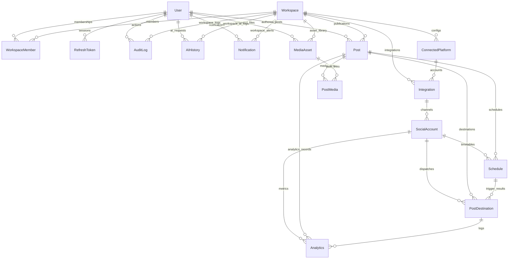

# Sched Database Architecture Documentation

This document describes the database design for **Sched**, a universal integration and content dispatch platform. The database uses **PostgreSQL** and is managed via **Prisma ORM**.

---

## 1. Architectural Highlights

*   **Universal Integration Schema**: System integrations are split into `ConnectedPlatform` (supported API adapters) and `Integration` (workspace credentials/tokens). Channels (e.g. Slack channels or Facebook Pages) are isolated under `SocialAccount`.
*   **UUID Primary Keys**: Every table uses a standard UUID version 4 format for high availability, distributed generation, and mitigation of enumeration attacks.
*   **Performance Indexes**: Indexes are placed on foreign keys, fields used for sorting/filtering (`createdAt`, `scheduledAt`, `status`), and fields queried uniquely (`email`, `token`, `code`).
*   **Soft Delete**: Core entity tables support logical soft-deletes via a nullable `deletedAt` DateTime timestamp.
*   **Cascade Delete Protocols**: Deletion of parent models (like `Workspace` or `User`) cascades down to clean up session tokens, credentials, and memberships, while preventing orphan records for static media or core content audits (`Restrict` or `SetNull` rules).

---

## 2. Entity Relationship Diagram (ERD)



---

## 3. Detailed Data Models

### A. Access Control & Users
*   **`User`**: Stored authentication hash and identity parameters.
*   **`RefreshToken`**: Session tracking table mapping cryptographic session secrets back to a `User` identity.

### B. Tenancy & Workspaces
*   **`Workspace`**: Tenant isolation entity. All publications, integration credentials, and files belong to a workspace.
*   **`WorkspaceMember`**: Membership bridge connecting a `User` and `Workspace` with permissions defined by `role` (`OWNER`, `ADMIN`, `MEMBER`, `EDITOR`).

### C. Connectors & Integration Catalogs
*   **`ConnectedPlatform`**: Global platform adapter catalog (e.g. `Slack`, `LinkedIn`, `Meta`, `Shopify`).
*   **`Integration`**: Holds credential connections, tokens (`accessToken`, `refreshToken`), configurations, and expiry logs for a specific Workspace's link to a platform.
*   **`SocialAccount`**: A target publication channel (e.g. `#general` Slack channel or a LinkedIn company page ID) mapped under an parent `Integration`.

### D. Publications & Content Library
*   **`Post`**: Core content body payload. Does not contain raw media urls or execution scheduling.
*   **`MediaAsset`**: Isolated library containing files, mime types, file sizes, and dimensions.
*   **`PostMedia`**: Many-to-many lookup table linking a `Post` to one or more `MediaAsset`s, mapping display sort order.

### E. Execution & Timetables
*   **`Schedule`**: Separated scheduling trigger registry setting publication date/times (`scheduledAt`) for specific `Post`s targeting specific `SocialAccount` channels.
*   **`PostDestination`**: Concrete output records capturing dispatch results, timestamps, HTTP error messages, and external platform return references (e.g. Facebook post ID or Slack timestamp).

### F. Operations Logs
*   **`Analytics`**: Captures time-series metrics over time (`views`, `clicks`, `replies`) for posts, channels, or destinations.
*   **`Notification`**: System alert records for users/workspaces.
*   **`AIHistory`**: Tracking token usage logs and prompt/response details.
*   **`AuditLog`**: Non-modifiable compliance logs tracking user actions within the system.

---

## 4. DB Shell Commands Directory

### 4.1 Schema Validation
Runs local syntax checks and model validates against the Prisma compiler:
```bash
npx prisma validate
```

### 4.2 Local Service Bootup
Builds database docker containers and hooks:
```bash
docker compose up -d
```

### 4.3 Database Migrations
Initiates state migrations and builds local SQL definition scripts:
```bash
npx prisma migrate dev --name init_database_foundation
```

### 4.4 Client Generation
Regenerates node query models under the application client:
```bash
npx prisma generate
```

### 4.5 Seeding Mock Data
Clears tables and inserts mockup configurations:
```bash
npx prisma db seed
```

### 4.6 Verification & Testing
Launches integration test runners to confirm database connectivity:
```bash
npm run test
```
